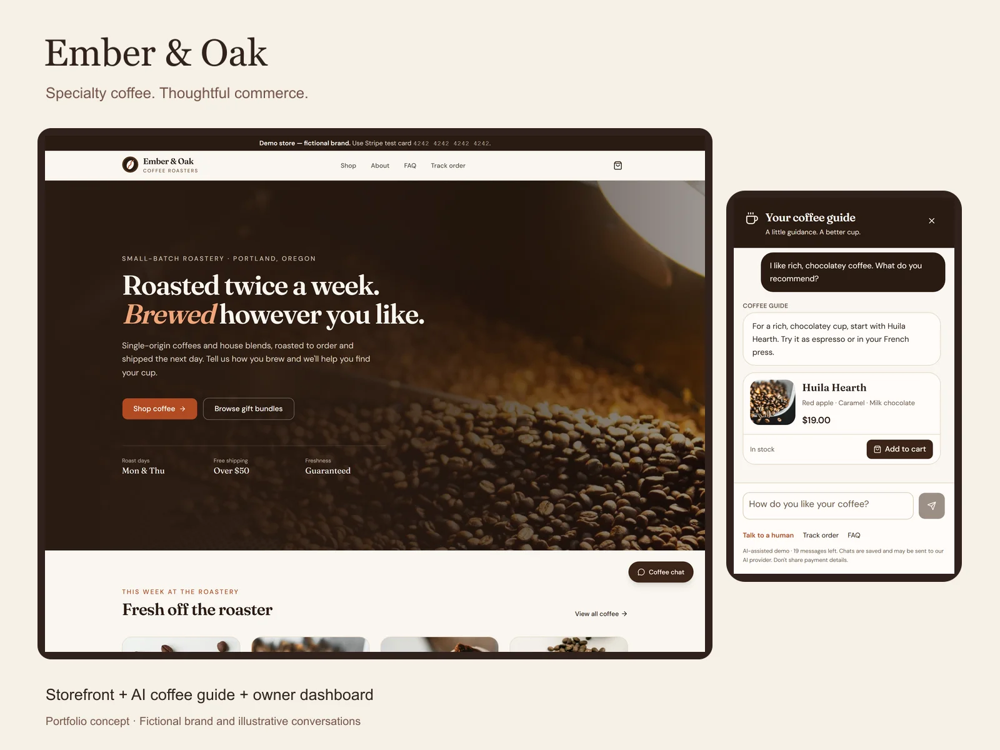
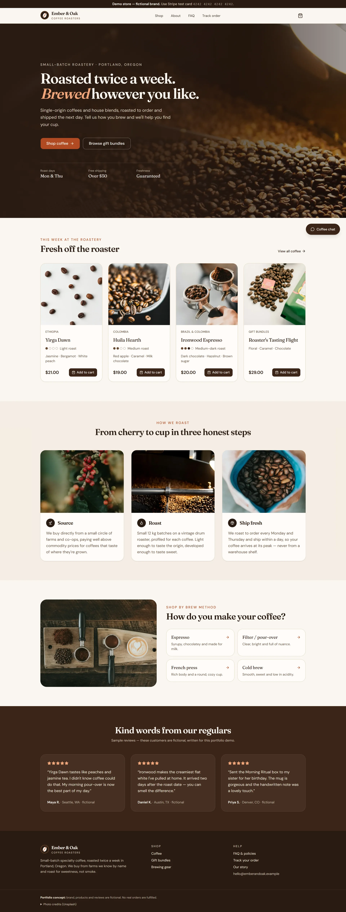
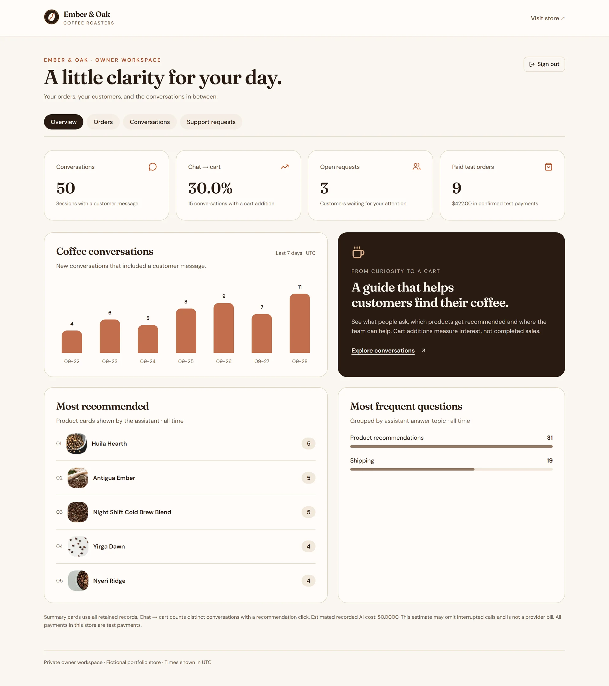

# Ember & Oak Coffee Roasters

A specialty coffee storefront with an AI shopping guide and a private owner workspace.

[▶ Live demo — publication pending](docs/DEPLOYMENT.md) · [Video walkthrough — TODO](#video-walkthrough)



Portfolio concept: brand, products and reviews are fictional.

## Screenshots

These are actual UI captures with staged fictional data in an isolated local database.
Chat replies are illustrative fixtures, not live Claude responses; prices and order
cards use database API results. Metrics are sample activity, not business results.
Public deployment and external services remain pending approval.

| Storefront | Owner workspace |
| --- | --- |
|  |  |

| Customer journey | Preview |
| --- | --- |
| Catalog with filters | [View catalog](docs/screenshots/02-catalog.webp) |
| Product details and grind choice | [View product](docs/screenshots/03-product.webp) |
| Server-priced cart | [View cart](docs/screenshots/04-cart.webp) |
| Recommendations and product cards | [View assistant](docs/screenshots/05-chat-recommendations.webp) |
| Order lookup in chat | [View order lookup](docs/screenshots/06-chat-order.webp) |
| Mobile storefront | [View mobile home](docs/screenshots/08-mobile-home.webp) |
| Mobile coffee guide | [View mobile chat](docs/screenshots/09-mobile-chat.webp) |

[Reproduce the screenshots](docs/SCREENSHOTS.md). Documentation images stay below
500 KB; originals and the 1600 × 1200 cover stay in ignored `portfolio-assets/upwork/`.

## What it does

- Helps customers find coffee by roast, brewing method and budget, then choose their grind.
- Keeps the cart between visits and calculates prices from the store's database.
- Offers test checkout, order confirmation and private tracking by order number plus email.
- Recommends products, answers written store policies and collects human-support requests.
- Gives the owner orders, conversations, editable support requests and useful metrics:
  popular recommendations, common questions and conversations that led to add-to-cart.
- Keeps a public demo manageable with protected seven-day cleanup and daily stock restoration.

This concept does not take real payments. Without provider keys, checkout explains
that it is unavailable, chat shows a friendly offline message, and confirmation emails
are logged. Support requests are saved, not sent to a real team.

## Stack

Next.js 16 App Router · React 19 · TypeScript · Tailwind CSS 4 + shadcn/ui · PostgreSQL ·
Prisma 7 · Zod · Stripe Checkout (test mode) · Anthropic SDK / Claude Haiku 4.5 · optional
Resend · Vitest + React Testing Library · Playwright · Sharp.

## How the chatbot works

Claude chooses a structured store action. `search_products` and `get_product` query
PostgreSQL; `get_order_status` requires the order number and matching checkout email.
The server validates the action with Zod and streams a bounded reply with cards.
Prices, stock and order details come from database results, not model-authored claims.
Store answers use the repository's FAQ and policies.

The guide declines unrelated topics, rejects obvious instruction attacks and avoids
promising discounts, refunds or shipping terms outside those policies. Tests include
hostile prompts and a false model price while checking the database price on the card.
No finite test suite proves immunity to every prompt attack; constrained actions limit
what model output can do.

Cost controls include PostgreSQL-backed IP limits, 20 messages per session, a
250-admission daily cap, the last 10 history messages, a 400-token output limit, a pinned
Haiku model and system-prompt caching. [DECISIONS.md](DECISIONS.md) explains estimated
conversation cost and its assumptions. Set a monthly Anthropic Console spending limit
before enabling a public demo. See [CHAT.md](docs/CHAT.md) for details.

## Run locally

Requirements: Node.js 24+, npm, Docker Desktop; PostgreSQL uses port 5433.

```bash
npm ci
cp .env.example .env.local
npm run db:up
npx prisma migrate deploy
npm run db:seed
npm run admin:token
npm run dev
```

Open [the store](http://localhost:3100) or [owner dashboard](http://localhost:3100/admin).
Sign in with `ADMIN_TOKEN` from your private `.env.local`. Never commit that file or
include the token in URLs. `DEMO_MODE` defaults to `false`; no daily deletion runs locally
unless explicitly enabled and the protected endpoint invoked. Re-seeding resets catalog
prices and stock.

In Windows PowerShell, use `Copy-Item .env.example .env.local` and `npm.cmd` / `npx.cmd`
when .ps1 launchers are blocked. No execution-policy change is required.

Provider setup is optional: [.env.example](.env.example), [CHECKOUT.md](docs/CHECKOUT.md),
[CHAT.md](docs/CHAT.md) and [ADMIN.md](docs/ADMIN.md).

## Validation

```bash
npm test
npm run test:integration
npx playwright install chromium
npm run test:e2e
npm run typecheck
npm run lint
npm run build
npm audit
```

Integration tests apply migrations to a dedicated local `_test` database and refuse
remote/non-test targets. Browser tests cover desktop and mobile through the Stripe
redirect boundary and chat. They do not execute a real hosted payment or deliver
email. [TESTING.md](docs/TESTING.md) maps requirements to evidence and limitations.

## Deployment and decisions

[DEPLOYMENT.md](docs/DEPLOYMENT.md) covers Vercel, Neon Free, every environment variable,
signed events, cron authentication, GitHub automatic deployment and approval steps.
[PROJECT_PLAN.md](docs/PROJECT_PLAN.md) tracks progress.
[DECISIONS.md](DECISIONS.md) explains the implementation in plain language.

## Video walkthrough

TODO: record and link the storefront, assistant and owner dashboard walkthrough after
the deployed demo is approved and available.

## Photo credits

Photography from [Unsplash](https://unsplash.com), also credited in the footer.
The fictional brand, product names and copy are original portfolio work.

| Use | Photographer and source |
| --- | --- |
| Yirga Dawn | [NordWood Themes](https://unsplash.com/photos/ivP3TYdLvw0) |
| Nyeri Ridge | [Alin Luna](https://unsplash.com/photos/lGl3spVIU0g) |
| Huila Hearth | [Wojciech Pacześ](https://unsplash.com/photos/OgJYC8q7QSE) |
| Antigua Ember | [pariwat pannium](https://unsplash.com/photos/S8daAB_nJSg) |
| Ironwood Espresso | [Zarak Khan](https://unsplash.com/photos/69ilqMz0p1s) |
| Old Growth Sumatra | [Tina Guina](https://unsplash.com/photos/obV_LM0KjxY) |
| Night Shift Cold Brew | [Łukasz Rawa](https://unsplash.com/photos/fmc-tFMMiBs) |
| Roaster's Tasting Flight | [Felipe Osorio](https://unsplash.com/photos/Y3DDn_uv0Ig) |
| Morning Ritual Gift Box | [Stacy](https://unsplash.com/photos/T3-2m-Xs7ZM) |
| Espresso Lover's Duo | [Sirius Harrison](https://unsplash.com/photos/7lvQ7zBOyew) |
| Hearthstone Hand Grinder | [Ashkan Forouzani](https://unsplash.com/photos/2AWQLHn7VLI) |
| Glass Pour-Over Brewer | [Erick Chévez](https://unsplash.com/photos/yCcx7BXE7i8) |
| Home hero | [Scott Soltys-Curry](https://unsplash.com/photos/_7CVm353m7A) |
| Brew bar | [Nathan Dumlao](https://unsplash.com/photos/KixfBEdyp64) |
| Coffee cherries | [Eduardo Gorghetto](https://unsplash.com/photos/vJ3KldG86Eo) |
| Roasting drum | [Scott Soltys-Curry](https://unsplash.com/photos/7p4SmQtWFHU) |
| Fresh bag | [Nathan Dumlao](https://unsplash.com/photos/PX1IrPsimHE) |
| About | [Tim Mossholder](https://unsplash.com/photos/YC6RVdoTtIk) |
